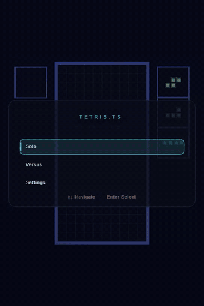

# tetris.ts

<p align="center">
  
</p>

A 3D Tetris (p5.js / WebGL) that builds for two targets from one codebase —
Electron (desktop) and a plain static web app — sharing the entire game,
engine and HUD. It merges two things:

- the **build & boot architecture** of the `coll-front/apps/desktop` app — Rollup
  for the main & preload processes, a `core/bootstrap` + `core/electron` boot
  flow, and a custom `app://` scheme to serve the renderer (React Router removed);
- the **Tetris game** from `tetris.ts`, ported off `electron-vite` and inlined
  into the renderer (no workspace packages).

It also dogfoods two local libraries (linked via pnpm `link:`):

- **[electron-run](../electron-libs/electron-run)** — a Rollup plugin that
  relaunches Electron on every rebuild in watch mode.
- **[electron-ipc-module](../electron-libs/ipc-module)** — type-safe Electron
  IPC: declare channels in `main/ipc/*.ipc.ts`, and its Rollup plugin generates
  a typed preload bridge (`window.electron.bridge.*`).

## Architecture

Two build targets share one renderer codebase (`renderer/src/{engine,scene,
hud,input,config,core,app/sketch.ts,app/events.ts}` — the entire game — never
changes between them). Only the bootstrap script and the HTML shell differ:

| Target   | Entry (HTML)                     | Entry (TS)                        | Output           |
| -------- | --------------------------------- | ---------------------------------- | ----------------- |
| Electron | `renderer/index.electron.html`   | `renderer/src/main.electron.ts`   | `dist-renderer/`  |
| Web      | `renderer/index.html`            | `renderer/src/main.ts`            | `dist-web/`        |

Vite's `--mode` flag picks the target (`vite --mode electron` vs the default
web mode) and drives `vite.config.ts`'s output dir, dev port, HTML entry and
dev-server API proxy — see the table in that file. Each target also loads its
own `.env.electron` / `.env.web`.

The two entries provide different implementations of the same `HighScores` /
`Host` interfaces (`renderer/src/app/host.ts`): Electron's talk to
`window.electron.bridge` over IPC, the web one talks to `/api/high-score`
over `fetch`. Because they're separate files, Electron-only code (the IPC
bridge, the titlebar wiring) is structurally absent from the web bundle —
not just dead-code-eliminated.

- **Electron dev**: Vite serves the renderer on `http://localhost:5173`;
  Rollup rebuilds the main/preload in watch mode and (re)launches Electron,
  which loads `/index.electron.html` off the dev server.
- **Electron prod**: Vite builds the renderer to `dist-renderer`, Rollup
  bundles the main/preload, and the app is served over the privileged
  `app://` scheme via a protocol handler registered in `core/bootstrap`.
- **Web dev**: Vite serves the renderer on `http://localhost:5174` and
  proxies `/api` to the small Express server in `server/` (started alongside
  it by `pnpm dev:web`).
- **Web prod**: Vite builds the renderer to `dist-web`; the same Express
  server serves it statically and answers `/api/high-score` — see
  [Web target](#web-target) below.

```
main/
  main.ts            # boot: window + app:// static handler + IPC container
  env.ts             # runtime config (paths, urls, dev/prod flag)
  preload.ts         # contextBridge: exposes the generated bridge
  core/
    bootstrap.ts     # app lifecycle (prepare)
    electron.ts      # createCustomScheme
  ipc/
    system.ipc.ts    # handle: ping, get-version
    window.ipc.ts    # listen: minimize / close / toggle-fullscreen
    game.ipc.ts      # typed events (high-score-beaten) + score persistence
  generated/
    ipc-bridge.ts    # generated by electron-ipc-module (git-ignored)
renderer/
  index.html           # web shell (no titlebar)
  index.electron.html  # Electron shell (frameless titlebar)
  styles.css
  src/
    main.ts            # web entry: fetch-based high scores, no titlebar wiring
    main.electron.ts    # Electron entry: bridge-based high scores + titlebar wiring
    engine/          # pure game engine (Game, Field, Piece, …) — no p5, no DOM
    app/             # composition root: p5 lifecycle, game loop, event wiring
    scene/           # the WebGL world: blocks, well, backdrop, particles, camera
    hud/             # p5-drawn chrome: HUD, menu, shared widgets
    input/           # keyboard → game actions (DAS/ARR)
    config/          # themes, key bindings, persisted settings
    core/            # colour, easing, geometry, DOM helpers
server/
  index.mjs          # Express: /api/high-score + static dist-web (web target only)
  high-scores.mjs     # file-backed store, the web twin of main/ipc/game.ipc.ts
  data/                # high-score.json (git-ignored, created on first submit)
resources/
  icon.png           # app icon (window + electron-builder)
scripts/
  gen-ipc.mjs        # standalone bridge generation (pnpm gen:ipc)
  clean.mjs
test/                # vitest: game engine + IPC modules + web high-score store
```

## IPC

Channels are declared with `electron-ipc-module` in `main/ipc/*.ipc.ts`:

```ts
export const systemIpc = defineIpcModule('system', {
  ping: handle(async () => 'pong'),
  'get-version': handle(async () => app.getVersion())
})
```

`pnpm gen:ipc` (also run automatically by the Rollup preload build) analyzes
these files and writes a typed `main/generated/ipc-bridge.ts`. The main process
loads the modules through a container, and the preload exposes the bridge:

```ts
// main
const ipc = createIpcContainer()
await ipc.loadAll({ system: systemIpc, window: windowIpc, game: gameIpc })

// renderer
const version = await window.electron.bridge.system.getVersion()
```

### Where each library feature lives

This app is meant to be a runnable tour of the two libraries — every notable
feature is exercised somewhere real:

| Feature | Library | Shown in |
| --- | --- | --- |
| `handle` (request/response) | electron-ipc-module | [`system.ipc.ts`](main/ipc/system.ipc.ts), [`game.ipc.ts`](main/ipc/game.ipc.ts) |
| `listen` (fire-and-forget) | electron-ipc-module | [`window.ipc.ts`](main/ipc/window.ipc.ts) — custom titlebar min/close/fullscreen |
| Typed emitted events → generated `onXxx` | electron-ipc-module | [`game.ipc.ts`](main/ipc/game.ipc.ts) `createIpcHelpers<GameEvents>()` → `bridge.game.onHighScoreBeaten(...)` |
| Container `loadAll` / multiple modules | electron-ipc-module | [`main.ts`](main/main.ts) |
| Rollup bridge codegen | electron-ipc-module | [`rollup.config.mjs`](rollup.config.mjs) + [`scripts/gen-ipc.mjs`](scripts/gen-ipc.mjs) |
| Live-reload on rebuild | electron-run | [`rollup.config.mjs`](rollup.config.mjs) (watch mode) |

The flow that ties them together: on game over the renderer calls
`bridge.game.submitScore(score)` (a `handle`); if it's a record, the main
process persists it and emits `high-score-beaten`, which the renderer receives
through the generated `bridge.game.onHighScoreBeaten(...)` and shows as a banner.

## Getting started

```bash
pnpm install
pnpm dev        # Vite + Rollup watch + Electron
pnpm dev:web    # Vite (web) + the Express server, at http://localhost:5174
```

Build and run the production bundle:

```bash
pnpm build      # typecheck + vite build (Electron) + rollup build
pnpm start      # electron . (loads app://)

pnpm build:web  # typecheck (renderer only) + vite build (web) → dist-web
pnpm serve:web  # node server/index.mjs — serves dist-web + /api/high-score
# or, in one step:
pnpm preview:web
```

`pnpm gen:ipc` regenerates the typed preload bridge; `pnpm typecheck` runs it
once before the per-process checks, and the Rollup preload build also regenerates
it via the `electron-ipc-module` plugin. Prefer `pnpm gen:ipc` on its own when you
only need the bridge file. `pnpm build:web` also depends on it, because
`index.d.ts`'s ambient `Window.electron` type references the generated bridge
file even though nothing in the web bundle imports it at runtime.

Lint and format (oxlint / oxfmt — configured in `.oxlintrc.json` and `.oxfmtrc.json`):

```bash
pnpm lint           # oxlint
pnpm lint:fix       # oxlint --fix
pnpm format         # oxfmt, writes in place
pnpm format:check   # oxfmt --check (what CI runs)
```

Other scripts: `pnpm clean`, `pnpm gen:ipc`, `pnpm typecheck`, `pnpm build:renderer`,
`pnpm build:renderer:web`, `pnpm build:main`.

> `electron-run` and `electron-ipc-module` are installed straight from GitHub
> (`github:antelm-dev/...`). They ship no built `dist/` in git, so each has a
> `prepare` script that compiles on install — `pnpm install` clones and builds
> them automatically. No local checkout of the libraries is needed.

## Web target

`server/index.mjs` is a small Express app with two jobs, mirroring
`main/ipc/game.ipc.ts` for the browser:

- `GET/POST /api/high-score` — backed by `server/high-scores.mjs`, a
  file-backed store (`server/data/high-score.json`, git-ignored) with the
  same validation and same serialized-write logic as the Electron IPC
  version, just parameterized by an explicit path instead of
  `app.getPath('userData')`.
- `express.static('dist-web')` + an SPA fallback, for production.

In dev (`pnpm dev:web`) only the API matters — Vite's dev server is what the
browser actually loads, and it proxies `/api` to this server (see the
`server.proxy` block in `vite.config.ts`). In production (`pnpm serve:web`)
the same process serves both. Port via `PORT` (default `4000`).

Because `renderer/src/main.ts` (the web entry) never imports anything
Electron-specific — no `electron`, no `electron-ipc-module`, no
`window.electron` access beyond a type that's never read at runtime — none
of that ships in the web bundle; `dist-web` is a plain static SPA deployable
anywhere that can also run `server/index.mjs` (or an equivalent static host +
a small backend for the high-score API).

## Testing

```bash
pnpm test         # vitest run
pnpm test:watch
```

Tests live in `test/` and run in Node (no Electron binary needed):

- **Game engine** — `Piece`, `Field`, `Game` as pure logic (line clears, lock-out,
  scoring, 7-bag determinism, gravity).
- **Input timing** — DAS/ARR / soft-drop clocks and simultaneous left/right
  resolution as pure helpers.
- **Settings** — recovery from malformed or incomplete `localStorage` payloads.
- **IPC modules** — the register functions are driven with a fake `ipcMain`
  (`test/ipc/fake-ipc.ts`); `electron` is aliased to a shared stub
  (`test/mocks/electron.ts`) in `vitest.config.ts` so the mock also covers the
  imports inside the linked `electron-ipc-module`. Score persistence rejects
  invalid values and malformed on-disk JSON.
- **External navigation** — `isAllowedExternalUrl` allowlists `https:` / `mailto:`.
- **Web high-score store** — `test/server/high-scores.test.ts` exercises
  `server/high-scores.mjs` against a temp file: the same validation and
  concurrent-write-safety coverage as the Electron IPC test, for its browser
  twin.

## Packaging

Distributables are built with [electron-builder](https://www.electron.build/)
(config in `electron-builder.yml`):

```bash
pnpm pack:dir       # unpacked app for the current OS (no installer)
pnpm pack:win       # unpacked Windows app in release/win-unpacked
pnpm pack:mac       # unpacked macOS app in release/mac (run on macOS)
pnpm pack:linux     # unpacked Linux app in release/linux-unpacked
pnpm dist           # installer for the current OS
pnpm dist:win       # NSIS setup + portable exe (run on Windows)
pnpm dist:mac       # DMG + zip (run on macOS)
pnpm dist:linux     # AppImage + .deb (run on Linux)
```

Cross-platform notes:

- Windows (`nsis`, `portable`) — build on Windows.
- macOS (`dmg`, `zip`) — build on macOS; `identity: null` keeps local builds unsigned.
- Linux (`AppImage`, `.deb`) — build on Linux (`mksquashfs`, `fpm`). From other OSes,
  `pnpm pack:linux` still produces `release/linux-unpacked` for inspection.

Because Rollup bundles the main/preload and Vite bundles the renderer, the app
ships only its built output (`dist-main`, `dist-renderer`) inside `app.asar` —
no `node_modules`. That's also why `electron-ipc-module` and `p5` live in
`devDependencies`: they're build inputs, bundled into the output.

## Controls

| Key   | Action    |
| ----- | --------- |
| ← / → | Move      |
| ↓     | Soft drop |
| Space | Hard drop |
| Z / X | Rotate    |
| Shift | Hold      |
| P     | Pause     |

## Scoring

Guideline-style scoring (all values are integers):

| Action | Points |
| ------ | ------ |
| Soft drop | 1 × cells |
| Hard drop | 2 × cells |
| Single / Double / Triple / Tetris | 100 / 300 / 500 / 800 × level |
| Spin (no clear) | 100 × level |
| Spin single / double / triple | 800 / 1200 / 1600 × level |
| Back-to-back (Tetris or spin clear) | × 1.5 on the clear |
| Combo | +50 × combo × level (from the 2nd clear in a run) |
| Perfect clear (all clear) | +800 / 1200 / 1800 / 2000 × level (by lines cleared) |

Back-to-back multiplies the line-clear score first; the combo bonus is then added
on top so the two stack. Soft- and hard-drop points are awarded as the piece
travels and are independent of clears.

## License

MIT
